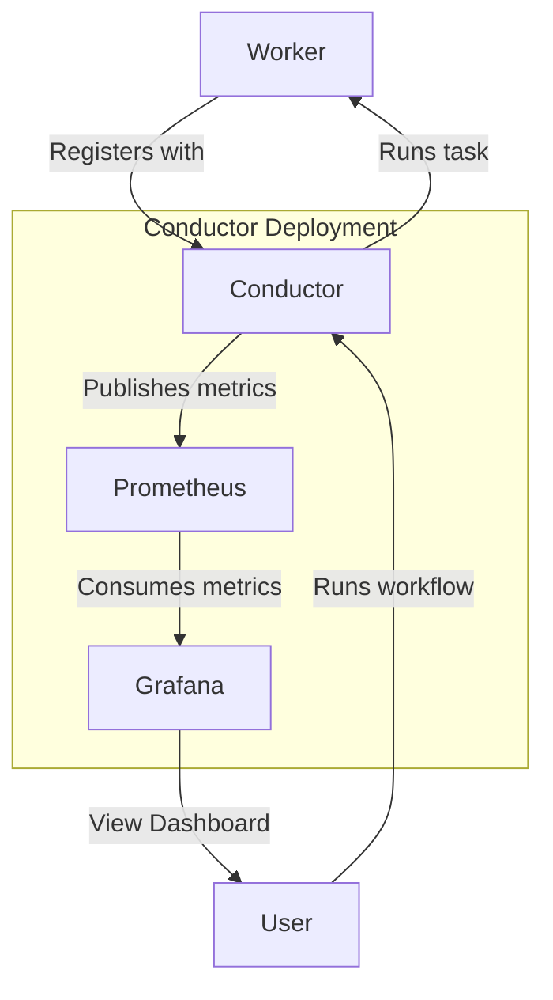

## Demo of Workflow Orchestration with Netflix Conductor with Observability Setup


## Table of Contents

- [Introduction](#introduction)
- [Design](#design)
- [Prerequisites](#prerequisites)
- [Build](#build)
- [Run](#run)
- [References](#references)

### Introduction

This demonstration features the seamless workflow orchestration with Netflix's Conductor with workers as Spring Boot
apps and observability over the orchestration.

### Design



#### Worker

- This is a microservice that has the code to execute one or more task types.

#### Conductor

- This is a service that is responsible for orchestrating the workflows.
- Registers workers that are capable of running tasks.

#### Prometheus

- Metrics collector

#### Grafana

- Metrics visualization tool

### Prerequisites

- [Docker](https://www.docker.com/products/docker-desktop/)
- [Docker Compose](https://docs.docker.com/compose/)
- [make](https://formulae.brew.sh/formula/make)

### Build

```shell
make build
```

### Start Conductor

```shell
make start-docker
```

### Add workflow

```shell
make add-workflow
```

### Start Worker

```shell
make start-worker
```

### Trigger a workflow run

```shell
make exec-workflow
```

### Trigger a faulty workflow run

```shell
make exec-workflow-faulty
```

With all services up, access:

| Description                           | Link                                        |
|---------------------------------------|---------------------------------------------|
| Conductor UI                          | http://localhost:5000                       | 
| Grafana UI                            | http://localhost:3000                       |                 
| Conductor REST API Playground         | http://localhost:8080/swagger-ui/index.html |                 
| Conductor Prometheus Metrics Endpoint | http://localhost:8080/actuator/prometheus   |                 
